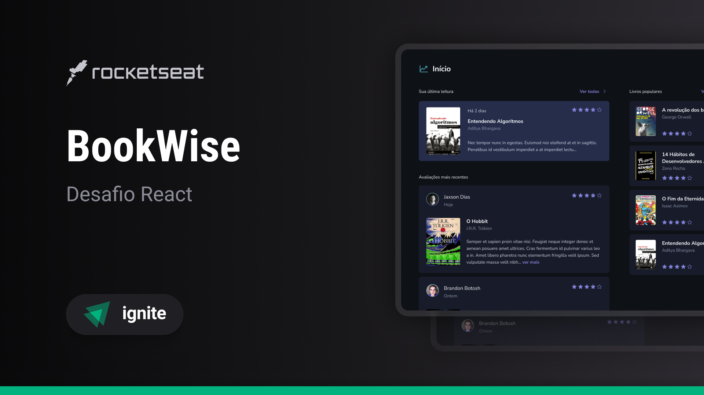

<p align="center">
  
</p>

<h1 align="center">
    
</h1>

<br>

## 🧪 Tecnologias

Esse projeto foi desenvolvido com as seguintes tecnologias:

- [React](https://reactjs.org)
- [NextJS](https://nextjs.org)
- [TypeScript](https://www.typescriptlang.org/)

## 🚀 Como executar

Clone o projeto e acesse a pasta do mesmo.

```bash
$ git clone 
$ cd book-wise
```

Para iniciá-lo, siga os passos abaixo:
```bash
# Instalar as dependências
$ npm install
# Iniciar o projeto
$ npm run dev
```
O app estará disponível no seu browser pelo endereço http://localhost:3000.

Lembrando que será necessário inserir CLIENT_ID e o CLIENT_SECRET tanto do Google quanto do Github, para poder fazer o login.

## 💻 Projeto

BookWise é uma aplicação web para recomendações para leitores, um lugar onde eles possam avaliar e ver avaliações de outros leitores sobre os mais diversos livros.
Esse projeto é um dos desafios da trilha de React do Ignite.

## 🔖 Layout

Você pode visualizar o layout do projeto através do link abaixo:

- [Layout Web](https://www.figma.com/file/phaOi5GwiuCYJuXA8PcWl6/BookWise--%E2%80%A2-Desafio-React-(Copy)?type=design&node-id=0-1&mode=design&t=teXEPJ5U2qEfvZho-0)

Lembrando que você precisa ter uma conta no [Figma](http://figma.com/).

## 📝 License

Esse projeto está sob a licença MIT. Veja o arquivo [LICENSE](LICENSE.md) para mais detalhes.

---

Feito com 💜 by Agacy Júnior 💻